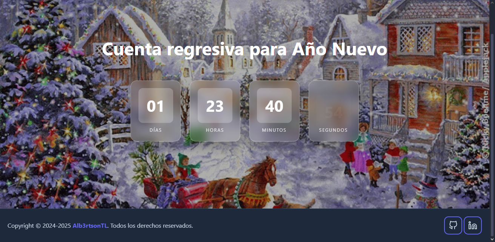

# 🎆 NewYear Timer

> Cuenta regresiva animada en tiempo real para la llegada del Año Nuevo — 100% estático, sin servidor ni PHP.



---

## 📋 Descripción

**NewYear Timer** es una página web que muestra una cuenta regresiva hacia el 1 de enero del próximo año. El año objetivo se calcula dinámicamente en el navegador, por lo que el mismo proyecto funciona año tras año sin modificaciones.

Cuando el contador llega a cero, lanza una celebración con confetti y muestra el año nuevo con animaciones de entrada, pulso y brillo.

### ✨ Características

- **Sin servidor**: corre completamente en el navegador (HTML + CSS + JS puro).
- **Año dinámico**: detecta automáticamente el próximo año nuevo con `new Date()`.
- **Animaciones**: flip de números con `slideFade`, confetti, shimmer y pulso en el año celebrado.
- **Responsive**: se adapta a móvil, tableta y escritorio con `clamp()` y flexbox.
- **Accesibilidad**: respeta `prefers-reduced-motion`, desactivando animaciones si el usuario lo prefiere.
- **Web Share API**: botón "Compartir" nativo en dispositivos compatibles.
- **SEO ready**: metas `og:*` y `twitter:card` incluidas.

---

## 📁 Estructura del proyecto

```
NewYear-Timer/
├── index.html      # Estructura y marcado
├── styles.css      # Estilos, animaciones y variables CSS
├── script.js       # Lógica del contador, confetti y compartir
├── img/
│   ├── fondo.gif           # GIF festivo al llegar año nuevo
│   ├── fondoNewYear.gif    # GIF de fondo durante la cuenta regresiva
│   ├── og-image.png        # Imagen para redes sociales
└── README.md
```

---

## 🚀 Uso

### Opción A — Abrir directamente en el navegador

```bash
# Doble clic en index.html o
open index.html
```

### Opción B — Servidor local (recomendado para que los GIFs carguen sin restricciones CORS)

```bash
# Python
python3 -m http.server 8080

# Node.js
npx serve .

# PHP
php -S localhost:8080
```

Luego visita `http://localhost:8080`.

### Opción C — Despliegue estático gratuito

Sube la carpeta completa a cualquiera de estas plataformas:

| Plataforma | Cómo |
|---|---|
| [GitHub Pages](https://pages.github.com/) | Push al branch `gh-pages` |
| [Netlify](https://netlify.com/) | Arrastra y suelta la carpeta |
| [Vercel](https://vercel.com/) | `vercel deploy` |
| [Cloudflare Pages](https://pages.cloudflare.com/) | Conecta el repositorio |

---

## ⚙️ Personalización

### Cambiar el año objetivo manualmente (opcional)

En `index.html`, justo antes del cierre del `<body>`:

```js
// Auto-detectado
const TARGET_YEAR = new Date().getFullYear() + 1;

// O forzar un año específico
const TARGET_YEAR = 2026;
```

### Modo debug (prueba la pantalla de celebración en 3 segundos)

En `script.js`:

```js
const DEBUG_MODE = true; // ← cambiar a true
```

### Colores principales

En `styles.css`:

```css
:root {
  --primary:      #6366f1;  /* botones y enlaces */
  --primary-dark: #4f46e5;  /* hover */
  --primary-light:#818cf8;  /* acento suave */
  --bg-primary:   #0f172a;  /* fondo general */
  --bg-secondary: #1e293b;  /* footer */
}
```

---

## 👤 Autor

**Albertson Terrero López** — [@Alb3rtsonTL](https://github.com/Alb3rtsonTL)

---

## 📄 Licencia

Este proyecto está bajo la licencia **MIT**.
Puedes usar, copiar, modificar y distribuir el código siempre que conserves el aviso de copyright y atribución al autor original.
Consulta el archivo [LICENSE](LICENSE) para más detalles.